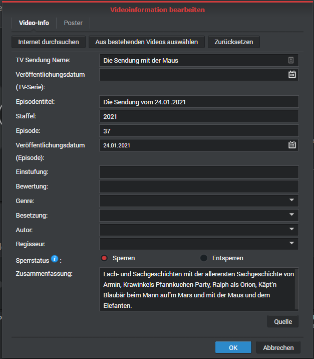
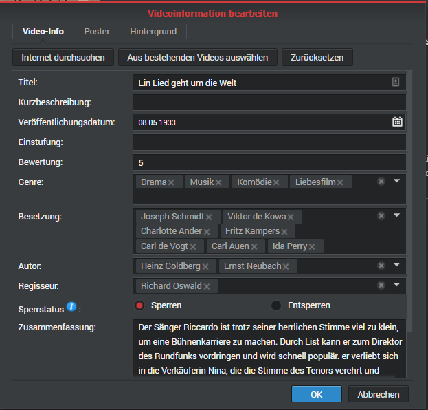

# mediathekDownloader
## What it does
 Downloads series and movies from German public media libraries (Öffentlich-Rechtliche Sender) to your Synology NAS, for use with Synology Video Station. It works from the command line and should be used from scripts.

## Setup

### Prepare your NAS

Make sure these packages are installed:
* Python 3.8 package is installed.
* Video Station
This can be done in the package center ('Paket-Zentrum').

### Prepare your media library

1. Open Video Station. In settings, select the library you want to use. Click on ```Export Metadata```. This will write ```.vsmeta``` files into the directories it's using, but triggers as well to use such file format to retrieve information about new videos the indexer finds.

1. When downloading videos, you will have to specify if you are either downloading episodes of a series (```-S``` option) or movies (```-M``` option). So, make sure your library is set-up correctly. Otherwise, media information provided by the ```.vsmeta``` file won't be interpreted. Important to remember: the path you are downloading to isn't the library - but needs to be assigned to your library. So, all directories below a library share the same media type setting implicitely.

### Install the python app

Steps to install via SSH (and currently, there is no other):

  1. Access your NAS via SSH.
  1. Choose a folder, e.g. home (```cd ~```), and create a virtual environment. Activate it.

      ```bash
          python3 -m venv mediathekDL
          cd mediathekDL
          source scripts/activate
      ```

  1. Install pip.
  1. Install the mediathekdownloader: 

      ```bash
          pip --install mediathekdownloader
      ```

### Test your installation

Still at the SSH shell, enter this command:

```bash
    python3 -m nediathekDownloader -h
```

As a result, you should get a help text, as shown below. You are done with the setup.

## How to use the app

### Principles

The app uses [https://mediathekviewweb.de](https://mediathekviewweb.de) to retrieve a list of files for download (more exactly: a feed). It sorts out any special emissions for disabled (sorry for that, but I tried to minimize download and will add an option to override this if necessary - just mail me).
Then, it starts multiple threads for downloading, writes a metadata file for Synology's videostation and triggers a re-indexing for the upload directory. To download only relevant file, I check for files already downloaded (saved in a history file called ```download.txt```) and existing files. If either exists, the download is skipped. Then, for episodes, it tries to detect strings saying something about the season and episode. If nothing can be found, then it takes the current year as season and the calendar week number * 10 + weekday (with Monday = 1, Sunday = 7) as episode number. Please mail me if you think you have a better method to set it for your downloads.

### Methods to tell how to find the media for download

- Using the search term: Go to [https://mediathekviewweb.de](https://mediathekviewweb.de) and search for your download.

    Example: ```!ARD #Maus >10``` to search for all episodes of "Die Sendung mit der Maus" at station "ARD" that are longer than 10 minutes (they provide a lot of short cuts for each episode, which is not really helpful if you want to retrieve an episode as broadcasted each Sunday morning).

    The command ```python3 -m nediathekDownloader -s '!ARD #Maus >10' -[S/M] directory ``` will download based on the search string.

- Using the feed. Same procedure, but now generate a feed at [https://mediathekviewweb.de](https://mediathekviewweb.de) and use the feed URL for retrieval. Example: ```python3 -m nediathekDownloader -f 'https://mediathekviewweb.de/feed?query=!ard%20%23maus%20%3E10' -[S/M] directory ``` will do the job.

## Command line

```sh
$:>python -m mediathekDownloader -h
Usage: mediathekDwnld.py [OPTIONS] PATH

  The app allows to retrieve videos from German, Austrian and Suisse TV
  station media libraries ("Mediathek").  Central accesspoint to these
  resources is https://mediathekviewweb.de/. Either the search string used
  there or the provided RSS-feed passed to the script using options
  --search or --feed. Idea is to write the file to a Synology NAS with DS
  Video app installed. This is why a .vsmeta file is being  generated with
  the media, to feed Synology's indexer.

Options:
  -f, --feed TEXT         Specify either the feed URL (RSS) or the search
                          string from mediathekviewweb.

  -s, --search TEXT       Specify either the feed URL (RSS) or the search
                          string from mediathekviewweb.

  -p, --threads INTEGER   The app supports multithreading. How many threads
                          should be started?  [default: 1]

  -m, --maxfiles INTEGER  When collecting a search result, several larger
                          files might be downloaded. Here, specify max=0 to
                          download all, or the maximum number to download.
                          [default: 8]

  -v, --verbous           Print program output at lowest level.  [default:
                          False]

  -V, --veryverbous       Print program output at lowest level plus feed
                          items.  [default: False]

  -t, --test              Do not really download or write files.  [default:
                          False]

  -S, --series            First option to set the media type: use it when
                          downloading episodes of a series.

  -M, --movie             Second option to set the media type: use it when
                          downloading movies.

  -h, --help              Show this message and exit.
```


### Example script

#### To be used in your NAS' task scheduler

```bash
#!/bin/sh
#encoding: utf8 

#Go to the directory of the venv - where this script should be located
cd /volumeX/[path]

#Download using the venv
bin/python3 -m mediathekDownloader -S -m 20 -v  -s '!ARD #Maus >10 <40' /volume1/video/Maus

#Rebuild video station's index
/usr/syno/bin/synoindex -R /volume1/video/Maus &
```

#### To be used at the command line

To download series, I use this script:

```bash
#!/bin/sh
#encoding: utf8

cd /volume2/nas-processes/mediathek-dl
bin/python3 -m mediathekDownloader -S -p 2 -s "$1" -m 4 /volume1/video/Serien-Mediathek-DL

/usr/syno/bin/synoindex -R /volume1/video/Serien-Mediathek-DL &
```

## Apendix

### Screen shots of the property screens for the media types

Here are the screenshots of the supported media types in German English (I did not had English screenshots at hand - please add them if you have).

 

# References

* Synology Video Station: 
    * [Help in Support Center](https://www.synology.com/en-en/knowledgebase/DSM/help/VideoStation/VideoStation_desc)
    * [Product Page](https://www.synology.com/en-en/dsm/feature/video_station)